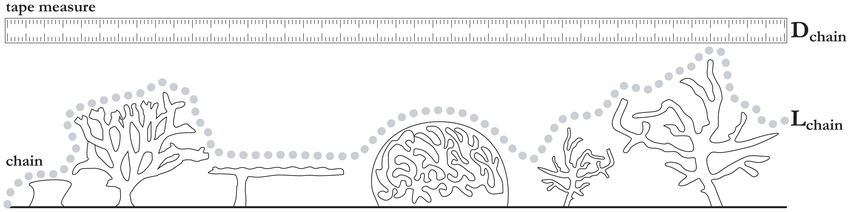
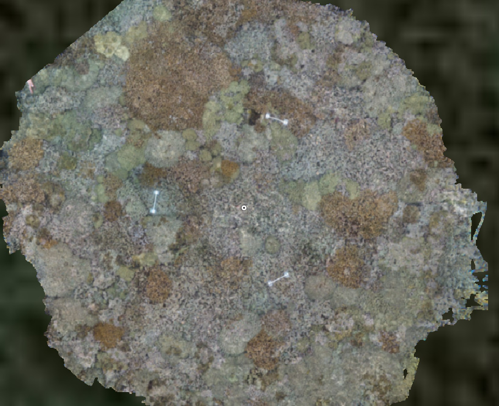
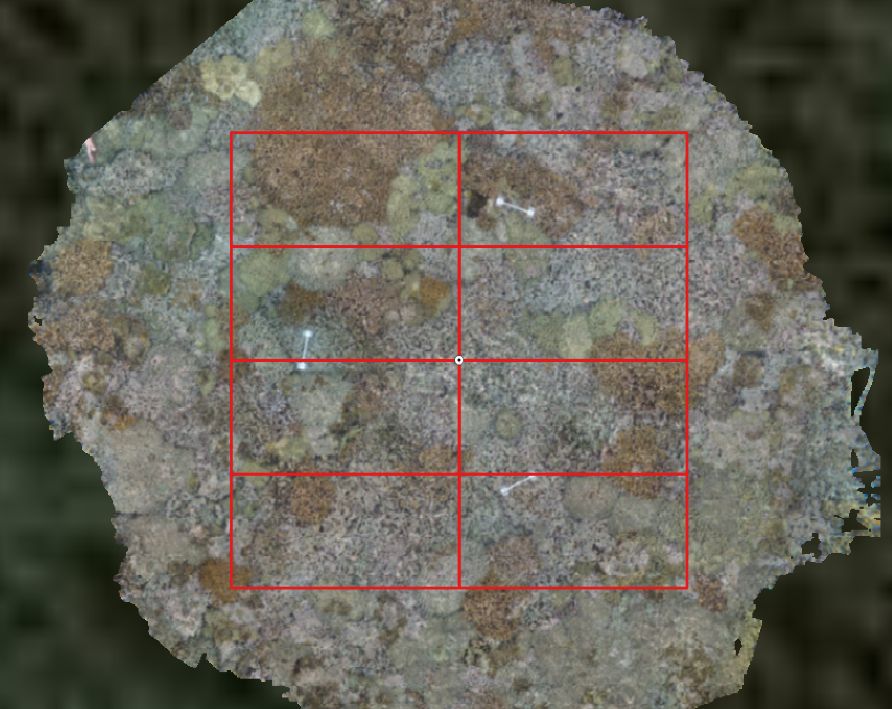

# Habitat geometry, biodiversity and structure from motion

### Aims

- To develop an understanding of habitat complexity, including familiarity with geometric measures like rugosity and fractal dimension.
- To relate differences among patches of coral reef in their location in geometric space to possible ecological and environmental implications.
- To become familiar with how to capture benthic 3D meshes and photomosaics and layer on ecological and environmental details.

### Introduction

One of community ecology's few paradigms is that complex habitats tend to contain more species and at higher abundances than simple habitats. Currently, human and natural disturbances are changing the complexity of habitats faster than at any previous time in history. Understanding and predicting the effects of these changes on biodiversity is now of paramount importance. Yet, we have only a crude, correlative understanding of how complexity changes affect biodiversity, predicting that if habitat becomes flatter, species' diversity and abundances decline. Generating accurate predictions requires integration of the geometric and ecological principles that underpin complexity-biodiversity relationships. 

Habitat geometry can be measured in many ways. However, in marine systems, surface rugosity has become gold standard, because it can be measured quickly with a tape measure and a length of chain. The chain is draped as closely as possible over the the benthos and then the linear distance between the two ends of the chain is measured (Fig. 1). Rugosity is calculated as $R = \frac{D_{chain}}{L_{chain}}$. If the surface is completely flat, then $D_{chain}$ will be the same as $L_{chain}$. On more convoluted surfaces, the linear distance $D_{chain}$ is shorter, and rugosity is greater. 



Many studies have found relationships between surface rugosity and the richness and abundance of associated species. Many studies have found no relationship at all, calling into questions what rugosity actually tells us about a habitat and how niches are distributed and partitioned. Advances in the way marine scientists can capture benthic surfaces have transformed our capacity to explore the geometric-biodiversity relationships. One such advance is the generation of surface structure from motion, which allows us to associate photomosics of benthic cover (essentially stitched together photographs over large areas) with the 3D surfaces upon which the biodiversity lives. 

### Objectives

1. Generate a reef mesh and calculate three geometric measure: rugosity, fractal dimension and height range. 
- Generate a photomosaic and annotate coral colonies with species names. 
- Analyze the relationship between reef geometric variables and biodiversity variables.

### Gear list ###

- Camera, set at 2 photos per second, charged
- Reef recorder (check clip)
- Three scale markers (6 targets)
- GPS to mark center of reef record
- Depth gauge for depths at markers
- Slate for notes (e.g., GPS, depths)

### Fieldwork ###

- Find site 1-2 metres deep
- Place reef recorder
- Place scale markers flat within anticipated map area, approximate triangle around reef recorder
- Attach camera
- Start camera and swim normally around stake, keeping line taut, in a spiral fashion
- When line in completely unwound, signal to buddy to remove reef recorder
- Swim across stake numerous time to create "spokes"
- Stop camera
- Record GPS coordinates above center
- Measure depth of scale markers
- Pick everything up and back to boat

### Labwork

- Export photos from camera into folder
- Open `MetaShape`
- Start new project
- Add `chunk` (button in `Workspace` panel)
- Add `photos` and select all the reef record photos (button in `Workspace` panel)
- `Tools` -> `Markers` -> `Detect Markers...`
- Go to `Reference` panel
- Open `Reference` settings (wrench and hammer symbol at the topright of reference pane)
- Choose WGS84 coordinate system (to give us lat and lon)
- Change "camera accuracy (m)" and "camera accuracy (deg)" to 2.
- Change ground altitude to -2. Leave all other defaults. 
- Open "orientation markers" spreadsheet (in docs folder)
- Enter target 1 lat and lon at top of spreadsheet.
- Enter distances and angles to targets 2 and 3 into columns and retrieve these targets' coordinates.
- Enter into reference pane in Metashape.
- Highlight target pairs from scale bars (using crtl key), right-click and add scale
- Enter scale distnaces in reference pane below the target pane.
- Start workflow process: align cameras first (accuracy Low).
- Using the measurement tool, check that the scale in the sparse cloud is approximately correct. All cameras should appear above the sparse cloud (if not, is one of the angles the wrong direction?  e.g., 180 degrees off?)
- Once happy with alignments, do the dense cloud step at Medium accuracy (this takes the longest)
- Generate 3D mesh, DEM and ortho-model using defaults. Then export them.

### QGIS

- Open QGIS
- To to "Plugins" and "Manage and Install Plugins..."
- Search for QuickMapService plugin and install it. Close the Plugin installer.
- Click of the globe icon with the search magnifying glass icon (or go to the "Web" menu and find the QMS search option).
- Search for "google sat" and "Add" the Google Hydrid Map.
- Drag the orthomosaic exported from Metashape onto the "layers" panel in QGIS (i.e., drag it from the Finder on Mac or Windows Explorer on PC).
- Right-click on mosaic layer in QGIS and "Zoom to layer".
- Zoom in further to find the "stake"
- Once located, you will make a shapefile for the stake. "Layer" -> "Create Layer" -> "New Shapefile Layer..."
- File name should be RRXX_pole. Then click the little box to the right and show where you want it saved (data/coral_annotations/RRXX/ is currently the correct place for this project)
- Click OK. (nothing else needs to be changed)
- With the new layer highlighted, click on the yellow pencil icon to "edit layer", then click on the icon with three dots over a yellow star to "add feature". Click on the mosaic where the stake is. 
- Click on the disk next to the yellow pencil to save the layer, then click the yellow pencil to turn on editing.
- Change the project cooridnate system to Google Maps Global Mercator (click the botton right part of QGIS with the coordinate system info to find this option).
- Click on the arrow/information icon and select the pole point you just created. We need the x and y values in the point information that should come up.



- Go to "Processing" menu and "Toolbox"
- Choose "Vector Creation" and then "Create grid"
- Grid type to rectangle. Ten copy and paste the x and y values for the pole into the Grid Extent box, each twice and with commas separateing them.
- Minus 4 and add four to each of these values to give our 8 x 8 meter bounding box that will be centered on the pole.
- Horizontal spacing should be 4. Vertical spacing should be 2.
- Click "Run"
- A grid should appear.  You'll need to save this as a shapefule using right-click on the layer that appears in the layer panel, and then choose "Export". The saving process in the same as for the "pole" above, call it "RRXX_grid" and don't forget to click the little box and say where to save it.



- At this point you can screen capture the various "tiles" and print them for annotation in the field. Use a big screen in order to screen capture in higher resolution, so easier to see in the water.

### Coral species annotation

- Create a new shapefile layer called "RRXX_JSM"
- Add fields "species" and "image_id", and use "text" and "simple number" respectively.
- Edit layer, click on colonies and label the species using predetermined codes.
- Save layers regularly!

### Calculate geometric variables

1. Load packages and functions.

```{r load_functions, echo=FALSE}
source("R/functions.R")
```

2. Reproject DEM rasters. Only run once.

```{r reproject}
# source("R/reproject_DEMs.R")
```

3. Set bounding box, 8 x 8 metres.

```{r set_window}

L <- 2 # extent
store <- data.frame()

for (rec in c("RR00")) {
  # rec <- "RR00"
  
  # Load geotif
  data <- raster(paste0("data/reef_records/", rec, "_DEM.tif"))
    
  # Take a look at the reef record spatial metadata
  data
    
  # Need to reproject raster so that using meters.
  sr <- paste0("+proj=tmerc +lat_0=", data@extent@ymin, " +lon_0=", data@extent@xmin, " +k=1 +x_0=0 +y_0=0 +datum=WGS84 +units=m +no_defs")
  
  # Get bottom left coordinate of 8x8m window
  pole <- readOGR(paste0("data/coral_annotations/", rec, "/", rec, "_pole.shp"))
  pole <- spTransform(pole, sr)
  
  coral_data <- readOGR(paste0("output/coral_annotations/", rec, ".shp"))
  coral_data <- spTransform(coral_data, sr)
  
  # points(pole@coords[1], pole@coords[2])
  
  x0 <- pole@coords[1] - 4
  y0 <- pole@coords[2] - 4
  
  # 4. Check that bounding box fits wholely within reef record.
  
  data <- raster(paste0("data/reef_records/", rec, "_DEM_RP.tif"))
  
  # png(paste0("figs/", rec, ".png"))
  image(data, asp=1, col=terrain.colors(50))
  points(x0, y0)
  rect(x0, y0, x0+8, y0+8, lty=2)
  # dev.off()
  
  # This divides into the 16 sub-windows for D, and calculation R as well
  for (i in seq(0, 8-L, length=8/L)) {
  	for (j in seq(0, 8-L, length=8/L)) {
  	  richness <- 0
  	  abundance <- 0
  	  
  	  coral_temp <- crop(coral_data, extent(x0 + i, x0 + i + L, y0 + j, y0 + j + L))
  	  # points(coral_data2, col="red")
  	  if (length(coral_temp) > 0) {
  	    coral_temp <- coral_temp@data
  		  richness <- length(unique(coral_temp$species))
  		  abundance <- length(coral_temp$species)
  	  }
  	  
  		reef_temp <- crop(data, extent(x0 + i, x0 + i + 2, y0 + j, y0 + j + 2))
  		L0 <- xres(reef_temp)
      H <- diff(range(values(reef_temp)))
  		reef_temp <- as(reef_temp, 'SpatialGridDataFrame')
  		R <- surfaceArea(reef_temp) / 4
      D <- D_func(H, R, L, L0)

      rect(x0 + i, y0 + j, x0 + i + 2, y0 + j + L, lty=1, border="white")
      text(mean(c(x0 + i, x0 + i + L)), mean(c(y0 + j, y0 + j + L)), paste("R=", round(R, 2), "\nD=", round(D, 2), "\nH=", round(H, 2)), col="black", cex=0.5)
  
  		store <- rbind(store, data.frame(rec=rec, x=i, y=j, L, L0, D, R, H, richness, abundance))
  	}	
  }
}

write.csv(store, paste0("output/master.csv"), row.names=FALSE)

```

### Analysis

```{r analysis}

master <- read.csv("output/master.csv", as.is=TRUE)

master$R_log10 <- log10(master$R)
master$H_log10 <- log10(master$H)

plot(abundance ~ R_log10, master)
plot(richness ~ R_log10, master)

plot(abundance ~ D, master)
plot(richness ~ D, master)

plot(abundance ~ H_log10, master)
plot(richness ~ H_log10, master)

# library(rgl)
# plot3d(master$R_log10, master$D, master$H_log10)

# Analysis

mod1 <- lm(richness ~ R_log10 + D + H_log10, master)
drop1(mod1, test="F")
summary(mod1)

```

### References

- Pizarro, O., Friedman, A., Bryson, M., Williams, S. B. & Madin, J. A simple, fast, and repeatable survey method for underwater visual 3D benthic mapping and monitoring. Ecology and Evolution 7, 1770–1782 (2017). [[link](https://doi.org/10.1002/ece3.2701)]
- Torres-Pulliza D, Dornelas M, Pizarro O, Bewley M, Blowes SA, Boutros N, Brambilla V, Chase TJ, Frank G, Friedman A, Hoogenboom MO, Williams S, Zawada KJA, Madin JS (2020) A geometric basis for surface habitat complexity and biodiversity. *Nature Ecology & Evolution* 4:1495-1501. [[link](https://doi.org/10.1038/s41559-020-1281-8)]
