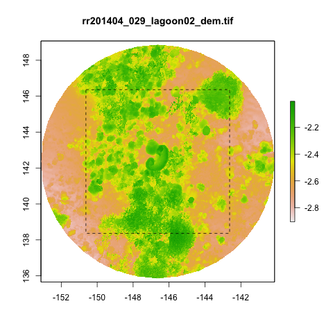

# Habitat geometry, biodiversity and structure from motion

This project looks at the relationship between reef structural complexity and coral and fish biodiveristy. You will clone this GitHub project and alter it during the week.

**Day 1: Photogrammetry I: image collection & processing**

- 9 am: Intro
- 11 am: Lunch and get gear
- 1-3 pm: Field, reef record / spiral
- 3:30 pm: Start processing

**Day 3: Photogrammetry II: annotation**

- 9-12 am: Field, coral annotation
- 12 am: Lunch
- 1-4 pm: Habitat complexity & biodiversity

