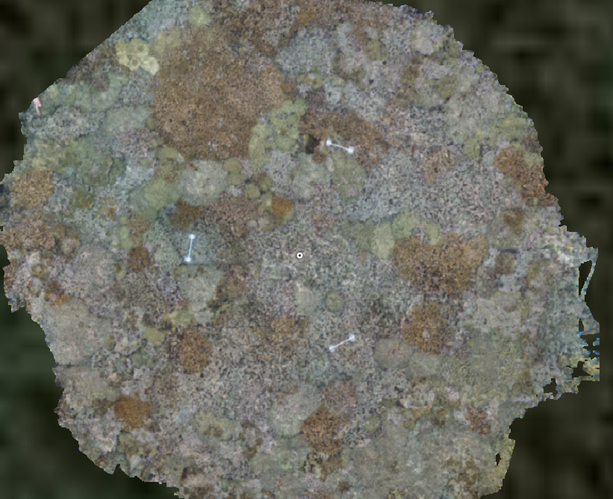
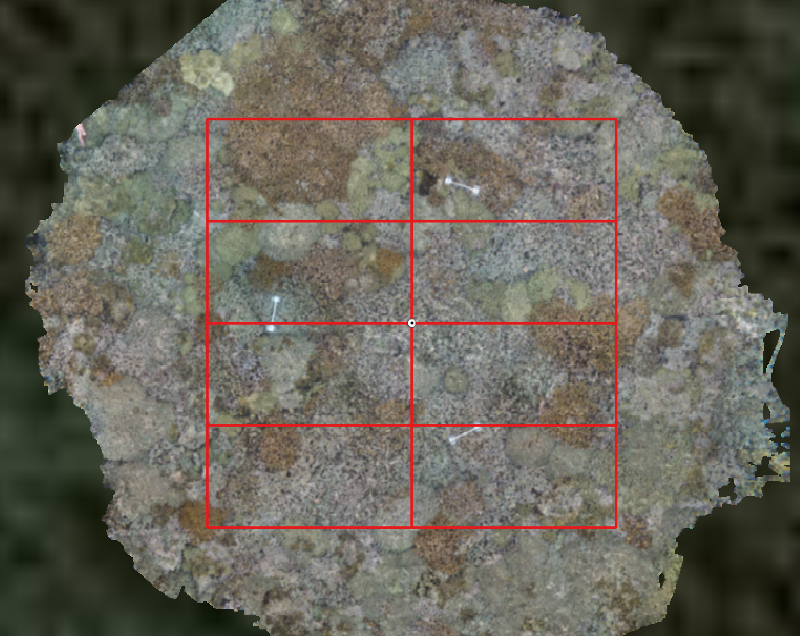
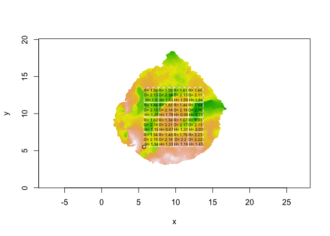
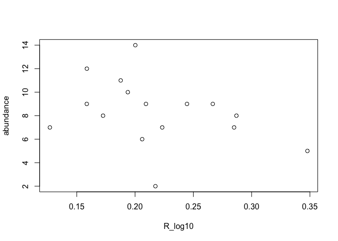
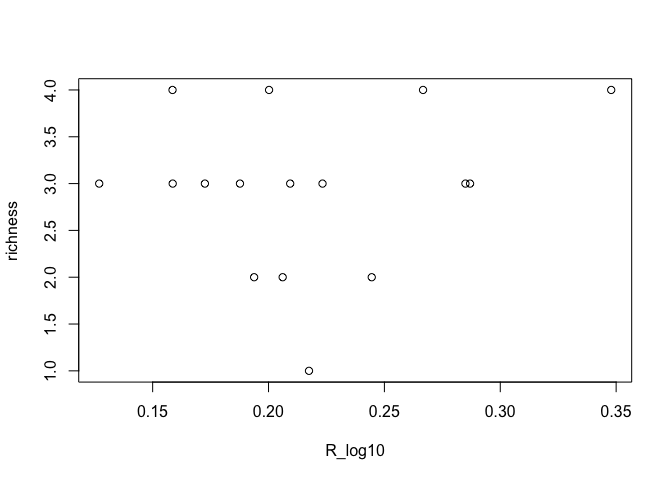
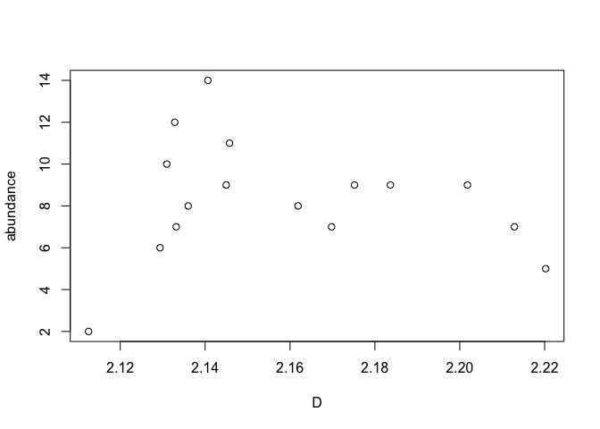
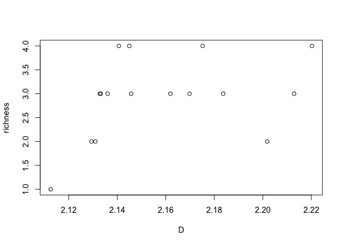
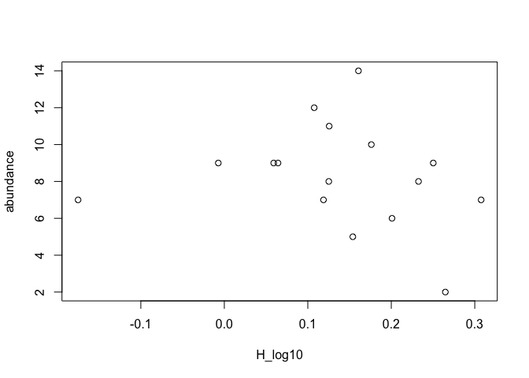
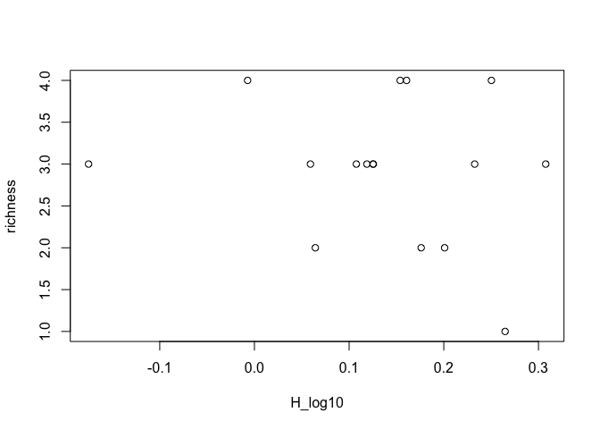

Reef geometry and biodiversity
================
Josh
5/18/2019

# Habitat geometry, biodiversity and structure from motion

### Aims

-   To develop an understanding of habitat complexity, including
    familiarity with geometric measures like rugosity and fractal
    dimension.
-   To relate differences among patches of coral reef in their location
    in geometric space to possible ecological and environmental
    implications.
-   To become familiar with how to capture benthic 3D meshes and
    photomosaics and layer on ecological and environmental details.

### Introduction

One of community ecology’s few paradigms is that complex habitats tend
to contain more species and at higher abundances than simple habitats.
Currently, human and natural disturbances are changing the complexity of
habitats faster than at any previous time in history. Understanding and
predicting the effects of these changes on biodiversity is now of
paramount importance. Yet, we have only a crude, correlative
understanding of how complexity changes affect biodiversity, predicting
that if habitat becomes flatter, species’ diversity and abundances
decline. Generating accurate predictions requires integration of the
geometric and ecological principles that underpin
complexity-biodiversity relationships.

Habitat geometry can be measured in many ways. However, in marine
systems, surface rugosity has become gold standard, because it can be
measured quickly with a tape measure and a length of chain. The chain is
draped as closely as possible over the the benthos and then the linear
distance between the two ends of the chain is measured (Fig. 1).
Rugosity is calculated as
.
If the surface is completely flat, then

will be the same as
.
On more convoluted surfaces, the linear distance

is shorter, and rugosity is greater.


Many studies have found relationships between surface rugosity and the
richness and abundance of associated species. Many studies have found no
relationship at all, calling into questions what rugosity actually tells
us about a habitat and how niches are distributed and partitioned.
Advances in the way marine scientists can capture benthic surfaces have
transformed our capacity to explore the geometric-biodiversity
relationships. One such advance is the generation of surface structure
from motion, which allows us to associate photomosics of benthic cover
(essentially stitched together photographs over large areas) with the 3D
surfaces upon which the biodiversity lives.

### Objectives

1.  Generate a reef mesh and calculate three geometric measure:
    rugosity, fractal dimension and height range.

-   Generate a photomosaic and annotate coral colonies with species
    names.
-   Analyze the relationship between reef geometric variables and
    biodiversity variables.

### Gear list

-   Camera, set at 2 photos per second, charged
-   Reef recorder (check clip)
-   Three scale markers (6 targets)
-   GPS to mark center of reef record
-   Depth gauge for depths at markers
-   Slate for notes (e.g., GPS, depths)

### Fieldwork

-   Find site 1-2 metres deep
-   Place reef recorder
-   Place scale markers flat within anticipated map area, approximate
    triangle around reef recorder
-   Attach camera
-   Start camera and swim normally around stake, keeping line taut, in a
    spiral fashion
-   When line in completely unwound, signal to buddy to remove reef
    recorder
-   Swim across stake numerous time to create “spokes”
-   Stop camera
-   Record GPS coordinates above center
-   Measure depth of scale markers
-   Pick everything up and back to boat

### Labwork

-   Export photos from camera into folder
-   Open `MetaShape`
-   Start new project
-   Add `chunk` (button in `Workspace` panel)
-   Add `photos` and select all the reef record photos (button in
    `Workspace` panel)
-   `Tools` -&gt; `Markers` -&gt; `Detect Markers...`
-   Go to `Reference` panel
-   Open `Reference` settings (wrench and hammer symbol at the topright
    of reference pane)
-   Choose WGS84 coordinate system (to give us lat and lon)
-   Change “camera accuracy (m)” and “camera accuracy (deg)” to 2.
-   Change ground altitude to -2. Leave all other defaults.
-   Open “orientation markers” spreadsheet (in docs folder)
-   Enter target 1 lat and lon at top of spreadsheet.
-   Enter distances and angles to targets 2 and 3 into columns and
    retrieve these targets’ coordinates.
-   Enter into reference pane in Metashape.
-   Highlight target pairs from scale bars (using crtl key), right-click
    and add scale
-   Enter scale distnaces in reference pane below the target pane.
-   Start workflow process: align cameras first (accuracy Low).
-   Using the measurement tool, check that the scale in the sparse cloud
    is approximately correct. All cameras should appear above the sparse
    cloud (if not, is one of the angles the wrong direction? e.g., 180
    degrees off?)
-   Once happy with alignments, do the dense cloud step at Medium
    accuracy (this takes the longest)
-   Generate 3D mesh, DEM and ortho-model using defaults. Then export
    them.

### QGIS

-   Open QGIS
-   To to “Plugins” and “Manage and Install Plugins…”
-   Search for QuickMapService plugin and install it. Close the Plugin
    installer.
-   Click of the globe icon with the search magnifying glass icon (or go
    to the “Web” menu and find the QMS search option).
-   Search for “google sat” and “Add” the Google Hydrid Map.
-   Drag the orthomosaic exported from Metashape onto the “layers” panel
    in QGIS (i.e., drag it from the Finder on Mac or Windows Explorer on
    PC).
-   Right-click on mosaic layer in QGIS and “Zoom to layer”.
-   Zoom in further to find the “stake”
-   Once located, you will make a shapefile for the stake. “Layer” -&gt;
    “Create Layer” -&gt; “New Shapefile Layer…”
-   File name should be RRXX\_pole. Then click the little box to the
    right and show where you want it saved
    (data/coral\_annotations/RRXX/ is currently the correct place for
    this project)
-   Click OK. (nothing else needs to be changed)
-   With the new layer highlighted, click on the yellow pencil icon to
    “edit layer”, then click on the icon with three dots over a yellow
    star to “add feature”. Click on the mosaic where the stake is.
-   Click on the disk next to the yellow pencil to save the layer, then
    click the yellow pencil to turn on editing.
-   Change the project cooridnate system to Google Maps Global Mercator
    (click the botton right part of QGIS with the coordinate system info
    to find this option).
-   Click on the arrow/information icon and select the pole point you
    just created. We need the x and y values in the point information
    that should come up.



-   Go to “Processing” menu and “Toolbox”
-   Choose “Vector Creation” and then “Create grid”
-   Grid type to rectangle. Ten copy and paste the x and y values for
    the pole into the Grid Extent box, each twice and with commas
    separateing them.
-   Minus 4 and add four to each of these values to give our 8 x 8 meter
    bounding box that will be centered on the pole.
-   Horizontal spacing should be 4. Vertical spacing should be 2.
-   Click “Run”
-   A grid should appear. You’ll need to save this as a shapefule using
    right-click on the layer that appears in the layer panel, and then
    choose “Export”. The saving process in the same as for the “pole”
    above, call it “RRXX\_grid” and don’t forget to click the little box
    and say where to save it.



-   At this point you can screen capture the various “tiles” and print
    them for annotation in the field. Use a big screen in order to
    screen capture in higher resolution, so easier to see in the water.

### Coral species annotation

-   Create a new shapefile layer called “RRXX\_JSM”
-   Add fields “species” and “image\_id”, and use “text” and “simple
    number” respectively.
-   Edit layer, click on colonies and label the species using
    predetermined codes.
-   Save layers regularly!

### Calculate geometric variables

1.  Load packages and functions.

<!-- -->

    ## Loading required package: sp

    ## rgdal: version: 1.5-23, (SVN revision 1121)
    ## Geospatial Data Abstraction Library extensions to R successfully loaded
    ## Loaded GDAL runtime: GDAL 3.2.1, released 2020/12/29
    ## Path to GDAL shared files: /Library/Frameworks/R.framework/Versions/4.0/Resources/library/rgdal/gdal
    ## GDAL binary built with GEOS: TRUE 
    ## Loaded PROJ runtime: Rel. 7.2.1, January 1st, 2021, [PJ_VERSION: 721]
    ## Path to PROJ shared files: /Library/Frameworks/R.framework/Versions/4.0/Resources/library/rgdal/proj
    ## PROJ CDN enabled: FALSE
    ## Linking to sp version:1.4-5
    ## To mute warnings of possible GDAL/OSR exportToProj4() degradation,
    ## use options("rgdal_show_exportToProj4_warnings"="none") before loading rgdal.
    ## Overwritten PROJ_LIB was /Library/Frameworks/R.framework/Versions/4.0/Resources/library/rgdal/proj

1.  Reproject DEM rasters. Only run once.

``` r
# source("R/reproject_DEMs.R")
```

1.  Set bounding box, 8 x 8 metres.

``` r
L <- 2 # extent
store <- data.frame()

for (rec in c("RR00")) {
  # rec <- "RR00"
  
  # Load geotif
  data <- raster(paste0("data/reef_records/", rec, "_DEM.tif"))
    
  # Take a look at the reef record spatial metadata
  data
    
  # Need to reproject raster so that using meters.
  sr <- paste0("+proj=tmerc +lat_0=", data@extent@ymin, " +lon_0=", data@extent@xmin, " +k=1 +x_0=0 +y_0=0 +datum=WGS84 +units=m +no_defs")
  
  # Get bottom left coordinate of 8x8m window
  pole <- readOGR(paste0("data/coral_annotations/", rec, "/", rec, "_pole.shp"))
  pole <- spTransform(pole, sr)
  
  coral_data <- readOGR(paste0("output/coral_annotations/", rec, ".shp"))
  coral_data <- spTransform(coral_data, sr)
  
  # points(pole@coords[1], pole@coords[2])
  
  x0 <- pole@coords[1] - 4
  y0 <- pole@coords[2] - 4
  
  # 4. Check that bounding box fits wholely within reef record.
  
  data <- raster(paste0("data/reef_records/", rec, "_DEM_RP.tif"))
  
  # png(paste0("figs/", rec, ".png"))
  image(data, asp=1, col=terrain.colors(50))
  points(x0, y0)
  rect(x0, y0, x0+8, y0+8, lty=2)
  # dev.off()
  
  # This divides into the 16 sub-windows for D, and calculation R as well
  for (i in seq(0, 8-L, length=8/L)) {
    for (j in seq(0, 8-L, length=8/L)) {
      richness <- 0
      abundance <- 0
      
      coral_temp <- crop(coral_data, extent(x0 + i, x0 + i + L, y0 + j, y0 + j + L))
      # points(coral_data2, col="red")
      if (length(coral_temp) > 0) {
        coral_temp <- coral_temp@data
          richness <- length(unique(coral_temp$species))
          abundance <- length(coral_temp$species)
      }
      
        reef_temp <- crop(data, extent(x0 + i, x0 + i + 2, y0 + j, y0 + j + 2))
        L0 <- xres(reef_temp)
      H <- diff(range(values(reef_temp)))
        reef_temp <- as(reef_temp, 'SpatialGridDataFrame')
        R <- surfaceArea(reef_temp) / 4
      D <- D_func(H, R, L, L0)

      rect(x0 + i, y0 + j, x0 + i + 2, y0 + j + L, lty=1, border="white")
      text(mean(c(x0 + i, x0 + i + L)), mean(c(y0 + j, y0 + j + L)), paste("R=", round(R, 2), "\nD=", round(D, 2), "\nH=", round(H, 2)), col="black", cex=0.5)
  
        store <- rbind(store, data.frame(rec=rec, x=i, y=j, L, L0, D, R, H, richness, abundance))
    }   
  }
}
```

    ## OGR data source with driver: ESRI Shapefile 
    ## Source: "/Users/jmadin/Dropbox/teaching/summer_course_2021/lessons/reef_geometry/data/coral_annotations/RR00/RR00_pole.shp", layer: "RR00_pole"
    ## with 1 features
    ## It has 1 fields
    ## Integer64 fields read as strings:  id 
    ## OGR data source with driver: ESRI Shapefile 
    ## Source: "/Users/jmadin/Dropbox/teaching/summer_course_2021/lessons/reef_geometry/output/coral_annotations/RR00.shp", layer: "RR00"
    ## with 148 features
    ## It has 1 fields

<!-- -->

``` r
write.csv(store, paste0("output/master.csv"), row.names=FALSE)
```

### Analysis

``` r
master <- read.csv("output/master.csv", as.is=TRUE)

master$R_log10 <- log10(master$R)
master$H_log10 <- log10(master$H)

plot(abundance ~ R_log10, master)
```

<!-- -->

``` r
plot(richness ~ R_log10, master)
```

<!-- -->

``` r
plot(abundance ~ D, master)
```

<!-- -->

``` r
plot(richness ~ D, master)
```

<!-- -->

``` r
plot(abundance ~ H_log10, master)
```

<!-- -->

``` r
plot(richness ~ H_log10, master)
```

<!-- -->

``` r
library(rgl)
plot3d(master$R_log10, master$D, master$H_log10)


mod1 <- lm(richness ~ R_log10 + D + H_log10, master)
drop1(mod1, test="F")
```

    ## Single term deletions
    ## 
    ## Model:
    ## richness ~ R_log10 + D + H_log10
    ##         Df Sum of Sq    RSS     AIC F value Pr(>F)
    ## <none>               8.8174 -1.5338               
    ## R_log10  1   0.61079 9.4282 -2.4622  0.8313 0.3799
    ## D        1   0.46800 9.2854 -2.7064  0.6369 0.4403
    ## H_log10  1   0.58255 9.3999 -2.5102  0.7928 0.3907

``` r
summary(mod1)
```

    ## 
    ## Call:
    ## lm(formula = richness ~ R_log10 + D + H_log10, data = master)
    ## 
    ## Residuals:
    ##      Min       1Q   Median       3Q      Max 
    ## -1.54762 -0.61938  0.09925  0.25925  1.33393 
    ## 
    ## Coefficients:
    ##             Estimate Std. Error t value Pr(>|t|)
    ## (Intercept)   170.59     211.29   0.807    0.435
    ## R_log10        50.88      55.81   0.912    0.380
    ## D             -80.85     101.30  -0.798    0.440
    ## H_log10       -31.41      35.27  -0.890    0.391
    ## 
    ## Residual standard error: 0.8572 on 12 degrees of freedom
    ## Multiple R-squared:  0.1938, Adjusted R-squared:  -0.007701 
    ## F-statistic: 0.9618 on 3 and 12 DF,  p-value: 0.4423

### References

-   Pizarro, O., Friedman, A., Bryson, M., Williams, S. B. & Madin, J. A
    simple, fast, and repeatable survey method for underwater visual 3D
    benthic mapping and monitoring. Ecology and Evolution 7, 1770–1782
    (2017). \[[link](https://doi.org/10.1002/ece3.2701)\]
-   Torres-Pulliza D, Dornelas M, Pizarro O, Bewley M, Blowes SA,
    Boutros N, Brambilla V, Chase TJ, Frank G, Friedman A, Hoogenboom
    MO, Williams S, Zawada KJA, Madin JS (2020) A geometric basis for
    surface habitat complexity and biodiversity. *Nature Ecology &
    Evolution* 4:1495-1501.
    \[[link](https://doi.org/10.1038/s41559-020-1281-8)\]
